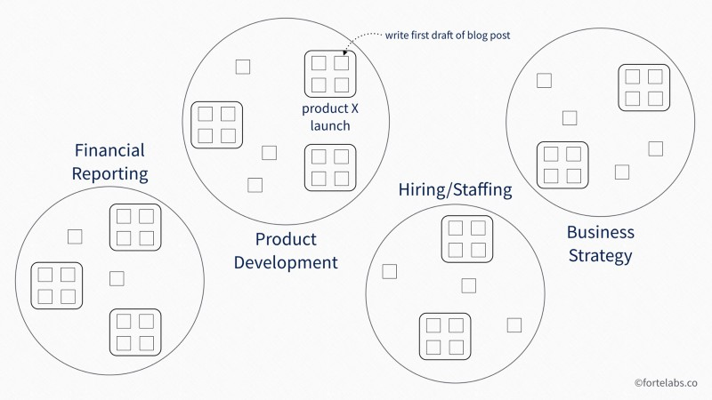

## 译者注: 前言

个人知识管理 (PKM) 是很有吸引力的概念, 它在TIAGO FORTE提出的*生产力金字塔模型*中处于第四层. 
TIAGO FORTE 提出了一套叫做 **P.A.R.A.** 的方法, 来实现个人知识管理.  

## PARA方法. 组织数字信息的通用系统

试想一下, 一个完美的组织系统. 一个能支持和加强你的工作的系统, 它能告诉你一个信息应该放在哪里, 以及在你需要的时候应该在哪里找到这些信息. 

这个系统必须是：

- **通用性**, 可以收纳, 管理 *任何来源的* *任何类型的* 信息
- **灵活**, 能够协同你 *现在* 和 *将来* 的任何项目或活动
- **简单**, 只需要很低限度的(时间, 经历) *维护*、*编目*、*标签* 或 *重组*
- **可操作**, 与 *任务管理* 和 *项目管理* 方法无缝集成
- **跨平台**, 可与任何现有或有待开发的应用程序一起使用
- **结果导向**, 以 *支持交付有价值的工作* 的方式组织信息
- **模块式**, 根据当前任务的需要, 允许隐藏或显示不同级别的细节
- **机会主义**, (利用现有资源/材料/机会之意), 它是指: 接手已有的整理过的信息, 而不是还需要专门的间从头来过. 

我相信我已经开发出了一套数字信息整理系统, 它能满足所有这些要求. 经过几年的介绍, 我对它的作用很有信心. 在这篇文章中, 我将尝试向大家展示一下. 

P.A.R.A.代表着**项目--领域--资源--档案**, 这四个顶级的类别包含了你在工作和生活中可能遇到的每一类信息. 

我们先说说定义. 这些都是非常精确的定义:

**项目**

:   是 "一系列 与目标相联系的 任务, 项目是有截止日期的" 
:   例子包括："完成应用程序模型；制定项目计划；执行业务开发活动；撰写博客文章；完成产品规格；参加会议. 

**领域 / 责任区**

:   是指 "一个有 **检验标准** 的活动领域, 其 **标准** 要长期保持. "
:   例子包括： 健康；财务, 职业发展；旅行；爱好；朋友；公寓；汽车；生产力；直接报告；产品开发；写作

**资源**

:   是指 "一个持续关注的**话题**或**主题**". 
:   例如：习惯的养成；项目管理；超人类主义；咖啡；音乐；园艺；网络营销；室内设计；建筑学；笔记

**档案**

:   包括 "其他三类中的不活动项目". 
:   例子包括：已经完成或不活动的项目；你不再致力于维护的领域；你不再感兴趣的资源. 

* * *

让我们换个形象的比喻. 

### 项目 VS 责任领域

这些定义似乎相当直接, 但我想确保 **项目** 和 **责任领域** 是完全不同的概念. 经过长期教学尝试, 我看到过很多人困扰于这两个概念之间的区别. 我意识到, 很多 *个人生产力底下的问题* 究其深层原因, 常常来自于 这两个概念之间 哪怕是最微小的混淆. 

#### 定义

让我们把这两个概念的定义分别分解成两部分: 

一个*项目*:

: 有一个要实现的**目标**

   - 一个我们期待发生的事件(期待完成的任务), 这个事件不可以是持续事件: 也就是说, 它是可以被完成的. 完成这个任务 意味着: 我们把它从 (为实现当前目标而确立的) 任务列表中彻底移除, 而不会再次出现. 
   - 而这个目标应该是在**特定的时间**发生. 它有一个期限或时间框架, 不管是外在的还是自己规定的. 

一个*责任领域* : 

: 有一个 **标准**, 需要维持. 而且没有一个 *结束日期* 或 *终极产出* . 你在这一 *责任领域* 的表现可能会随着时间的推移而起伏不定, 但标准会**无限期地持续下去**, 并要求你在任何时候都要保持一定的关注度. 

"项目" 总是属于 "领域". 下面举几个例子:

* 跑马拉松 是一个项目, 而健康是一个领域. 
* 出版一本书 是一个项目, 而写作是一个领域. 
* 节省3个月的开支 是一个项目, 而财务是一个领域. 
* 去泰国度假 是一个项目, 而旅游是一个领域. 
* 策划结婚周年晚宴 是一个项目, 而配偶则是一个领域. 

在所有这些例子中, 

- 项目都有完成日期, 它们有两种状态: 被 *完成* 了 或是 *未完成*. 
- 而责任区, 则有必须无限期维持的绩效标准. 

#### 一个反例

现在我们已经打好了基础, 我们来看一个反例: 这两个概念之间哪怕是微妙的混淆, 也会造成很多问题. 

当我以生产力教练的身份与客户合作时, 我首先会要求他们给我看他们的项目清单. 我需要这个来了解他们做的是什么类型的工作, 他们目前的工作量, 以及他们正在积极努力实现的成果. 

他们通常会递给我一些看起来像这样的东西. 

你发现问题了吗? 这个清单上没有一项是项目. "休假 "有结束的时候吗? 有没有一次可以把 "生产力 "从你的清单上一劳永逸地划掉? 没有!! 
这些都是正在进行的责任领域, 而不是项目. 

> 那又怎样? 这只是文字游戏, 对吗? 

我不这么认为. 除非你把你的**责任领域**分解成明确的**项目**, 否则, 有三件非常关键的事情 你*做不到*. 

- 第一, **你不能真正知道你的 承诺业绩**

    

    我经常被问及一些 属于 "个人工作能力 / 能力利用率" 类 的问题: 

    * 我如何知道: 我该 减少工作量? 还是增加工作量? 
    * 我如何知道: 在某个特定的时间点, 我应该参与多少项目? 
    * 如何正确平衡 *短期项目* 和 *长期项目* ? 或者, 如何权衡 *研究开发 VS 生产*, 或 *计划 VS 执行*, 或 *分析 VS 总结综述*, 等等?

    但是, 对于某一个特定的人, 在对他的 工作量 和 项目组合 有了一定的了解之前, 我甚至无法开始回答这些问题. 

    - 看看上图中左边的列表 --"招聘/人员配置" 是否能让你对这个人的 工作量 或 承诺业绩 有任何感觉? 
      - 没有! "招聘/人员配置"这样的表述 可能对应着 从"每周工作几分钟" 到 "全职工作", 以及介于两者之间的任何工作强度. 这样的清单是一个黑匣子, 没有给我任何信息. 
    - 现在看看右边的对应项目列表 -- 这是不是能让你更好地了解这个人的工作量, 甚至是他们所从事的项目的性质? 

    在你知道自己所承诺的事情之前, 你不可能知道要改变什么. 而你承诺要做到的东西, 并不是 *模糊的* 一堆责任, 而是一串 *有形的* 结果. 换句话说, **你承诺要做到的东西 是 *项目*: 一系列 *有结果输出的* 任务.**

- 第二, **你不能把 你*目前的努力* 和 你的*长期目标* 联系起来：**

    

    我常说, 对于知识工作者来说, 最大的瓶颈永远是早上起来的时候. 
    知识工作不仅需要我们的时间和精力, 还需要我们的参与度和创造力. 
    正因为如此, 个人的积极性才是压倒一切的首要问题. 

    现在, 想象一下, 日复一日, 周复一周, 月复一月, 甚至年复一年, 从左边的列表中醒来, 会产生怎样的心理效应? 
    责任领域很少会有变化, 记得吗? 无论你多么努力工作, 付出多少年的努力, 永远不变的责任清单只会越来越重, 越来越长. 没有比这 更扼杀个人的积极性的了. 

    通过将这些责任分解成 小的项目（如右图中的清单）, 你可以确保你的项目清单几乎每周都会有变化. 这样就会产生一种 *工作节奏* 和 *完成项目* 的推动力, 以 保持 你的 心理积极性. 
    这能产生不断的 *新奇感*. 而最新的[研究](https://www.amazon.com/Satisfaction-Science-Finding-True-Fulfillment/dp/080507600X)表明, 这样的体验 是产生 *心理满足感* 必不可少的. 

    而且, 你 *总可以* 将你的责任分解成更小的项目. 即使那些可能需要数年时间才能产生新产品的研究（如上面的例子）, 它们也会有一连串的实验 和 实验产出, 哪怕这些产出 只是 "证实了某个假说 "或 "得到某些观察结果(而, 没有突破性的结论)". 请记住, 一个 "项目" 没有 *内在的结构* (它是被一连串的tasks, Outcome, deadline定义的) 或 *可单位化计量的工作* (只有tasks, 和可以被计量的Outcomes). 你不必接受你的经理、团队或组织对项目的定义!

- 第三, **你无法知道自己是否在向着目标前进：**

    

    你是否有过这样的经历：准备年度绩效考核, 却不知道自己在过去一年里取得了什么成就? 这让你的士气低落, 让你没有 合适的心态 走进经理的办公室, 骄傲地说出自己的成就. 更不用说谈判升职或加薪了. 

    现在想象一下, 如果你把这个 "事件 "区域分解成你策划和执行的每个单独的事件. 这不仅可以显示出你所经历的清晰的进步和成长, 每一个事件都是在前一个事件的基础上建立起来的, 它还可以方便地给你提供一个你所达到的成果目录, 以便在年终的时候将其纳入你的绩效考核中. 而且, 你不仅会有一个成果目录 -- 对每一个完成的项目, 你还会有单独的文件夹, 其中包含 实实在在记录的笔记(而非大脑中可能已经遗忘的记忆)、积累的财富(知识, 资源) 和 创造的新的知识. 

#### 不同的思维方式, 处理方式, 工具 和 方法

关于 项目 VS 责任领域 的最后一点是：它们需要完全不同的 *思维方式* 、 *处理方式* 、 *工具* 和 *方法* :

- **项目** 需要你 像激光一般聚焦精神, 心无旁骛地 朝着一个结果前进, 冲破 或 绕过 障碍, 无视纷扰（即, 来自人的打扰）. 
- 而**责任领域**, 则需要 *心态*、*权衡(斟酌)*、*流动性* 和 *人与人之间的联系*.  在这里我们经常谈论 *习惯* 、 *套路化的流程* 、 *仪式* 和 有共同目的的(共同利益的)团体.  **责任领域** 需要 反省 和 自我意识(自知之明) ,  因为确定你是否达到 *标准* 是一项 凭直觉的工作, 而不是分析性的工作. 

你很容易看到, 不做出这种区分如何诱发常见的挫败感：

- 如果你把一个 **项目** 当成了 **责任领域**（比如说, 我已经 "写 "了几年的书, 感觉这本书是我生命中永远也写不完的部分）, 那么它往往会无限期地延续下去. 
- 如果你把一个 **责任领域** 当成了 **项目**（比如说 "减掉X磅 "这样的健康成果）, 你会在达到标准之后, 马上就会反弹回来, 因为你没有建立任何机制来维持这个标准. 

#### 项目, 爱好 和 梦想

一旦你花时间制定了一个明确的项目清单, 有一个很有启发性的练习:

:   把它和你的目标清单并排放在一起, 把每一个项目与相应的目标相匹配的线条画出来. 
    

大多数人发现的是, *项目清单* 和 *目标清单* 并不完全匹配. 这是有问题的, 因为一个没有相应目标的项目应该叫做 "爱好". 

"爱好"

: 如果你没有承诺或者没有完全阐明你想要的结果, 那么你一定是为了好玩而做, 这就是 "爱好". 

"梦想"

: 而如果你有了目标而没有相应的项目, 那就叫 "梦想". 你可能全心全意地渴望它, 但如果没有一个积极的项目, 其实你目前并没有任何进展. 

现在, *爱好* 和 *梦想* 并没有错. 它们赋予生命的意义和目的. 但是, 请不要把它们与 *项目和目标* 混为一谈. 

- 要清楚地知道自己在哪些方面取得了进展, 就必须清楚地知道自己在哪些方面没有进展. 
- 要想对不重要的事情说 "不", 就必须清楚 什么是重要的事. 

## PARA方法 的 实践

### 首先, 定义你的项目列表 

这里的底线是, **定义你的项目, 否则他们会定义你的**. 

- 你会不断地被拉进 或 被推到 *别人的项目* 中去, 
- 你会发现, 即使别人提出来帮你做 *你的项目* , 你也不知道它们是什么 (即, 不知道组成项目的*任务链*是什么). 

#### 建议: 分离 项目的定义 和 来自工具的暗示

而, 定义你的项目, 需要 你把 *你的项目* 独立于 *任何特定的工具* (包括软件工具) 来定义. 
把它们写在一张纸上或空白的文档中, 远离任何软件程序的暗示、激励、约束和假设. 

这种分离, 可以让你 自由地选择任何程序 来 展开 扩展和体现这些项目. 

#### 为什么"分离"

下面是为什么这一点很重要：你总是需要使用多个程序来完成项目. 你可能会使用像Basecamp、Asana、Jira或Zoho这样的集中式平台, 但技术在太多领域的发展速度太快了, 任何一家公司都无法做到每一个功能都是最好的. 

与其受技术发展的牵制, 迷失在寻找 "一个平台来统治所有平台"的管理方式中, 不如制定你的项目清单, 然后把这个清单复制到你现在和将来使用的每一个工具上. 我建议 在不同平台, 用完全相同的: 拼写, 标点, 大小写, 以便 使你的程序之间的 尽可能的 无缝衔接. 

我注意到, 人们往往在每一个程序中都会使用不同的组织方案. 他们试图根据每个程序的能力来适应不同的方案, 迫使他们的大脑在每次切换程序时都要 "加载" 并记住不同的方案. 这对学习可能更适合专业任务的新工具产生了摩擦, 抑制了创新. 

在上面的图例中, 每个程序中的项目列表是相同的, 可以进一步扩展到其他任何数量的程序. 这样既可以利用每个程序的独特能力, 又可以保持项目层的跨界面统一. 

P.A.R.A.给你提供了两个世界中最好的东西：集中化的**一致性**, 分散化的**适应性**. 

### PARA方法 的 三个核心原则

- 第一个原则是, 它**用数字4作为指导**. 整个层次结构是**四类**（项目、区域、资源、档案）, 深度不超过**四级**（以Evernote为例, 其层次应该是：应用>堆栈>笔记本>笔记）. 

   根据[研究](https://www.ncbi.nlm.nih.gov/pubmed/11515286)表明, 四这个数字被称为 "神奇", "4" 似乎是各种认知过程的自然极限, 从 *工作记忆* 到 *对象追踪* 到*快速枚举* (快速为某类事物举例), 都是如此. 在更多的推测性发现中, 一些原始部落似乎只有数字4以下的特定词汇, 而许多动物似乎能够分辨出最多四个独立的物体. 

   无论这是否是一个真正的限制, 它都是一个有实用价值的约束, 可以防止度工程化的组织信息 两大罪状：
   
   - 过多的类别
   - 过多的层次结构. 

-  第二个原则是, P.A.R.A.**完美地反映了你的 *任务管理* 和 *项目管理* 系统**. 在 [个人知识管理](https://en.wikipedia.org/wiki/Personal_knowledge_management) (PKM) 这个相对年轻的领域, 有很多的可以探讨的主题, 但我相信任何不与 *执行工具* 结合的 *PKM方式* (approach) 都注定要永远被搁置. 

   

- 第三个原则是, P.A.R.A.保留并实际上加强了任何生产力系统必须作出的最重要的区分: **在 *可操作的信息* 和 *不可操作的信息* 之间** 的区分. 做好这个区分, 可以让你把95%的信息放在一边, 专注于手头的任务所需的5%. 

  > 它是如何提高 *可操作性* 的? 
  
  通过认识到 *可操作性* 并不是非黑即白. 相反, 可操作性 更应当称作 可操作度. 一个根据 谈论*可造作性*时, 我们正在面对的 不同问题背景, 而 或许 可见, 或许 不可见的光 [^1]. 这遵循了一种著名的设计技巧, 叫做 /*progressive disclosure* --只向用户展示他们当下需要的信息. 这有助于最大限度地减少知识工作者的 *认知负荷*. 

  [^1]: 译者也没有完全看懂这句话, 原文是: 

      > it (这里指 Actionability) is instead a gradient, a spectrum that should be hidden or revealed depending on the context.

  

### P.A.R.A.方法 在日常生产生活中的体现

日复一日, 在完成事情的过程中, 你可能会把注意力集中在(上图中的)第一列, 只看与 *当前活跃项目* 相关的材料. 这可能包括你的任务管理器（或至少是任务管理器中的 "(Today)今日安排" 或 "(Next)近期待办" 部分）以及像Evernote这样的记事程序中的 "项目" 堆栈. 

在稍大一些的时间维度上, 比如说, 在做每周回顾的时候, 你会把你考虑的信息范围扩大到 *责任领域*. 这是一个更深层次的反省：

- 你目前是否在每个 *责任领域* 都达到了你为自己设定的标准? 
- 如果没有, 是否有任何新的项目、习惯、例程、仪式或其他你想开始、停止或改变的做法? 

在更广阔的时间维度上, 也许在每月的复习中, 你可以把你所关注的范围扩大到 *资源* 方面. 

- 是否有任何新的兴趣爱好, 你想更认真地去追求? 
- 是否有一些你已经让你停滞不前, 想重新启动的项目? 
- 你目前的项目中是否有任何一个项目给了你一个同时追求相关兴趣的借口? 

*资源* 栈也是 "做研究" 的地方. 这里的笔记本往往有最客观的有价值的信息, 当你想在博客文章中寻找素材、推荐给别人或工作项目时, 你可能会想获取这些信息. 下面是我自己的收藏, 可以很好地说明我的兴趣所在, 每个笔记本标题右边的笔记数量显示了我在这个主题上收集了多少笔记. 

最后, *档案* 是你已完成的项目组合, 每个项目都是不活跃的, 但可以提供潜在的有用材料, 在未来的项目中重复使用和循环使用. 我经常发现, 能够重复使用我对某一主题的笔记、精心设计的幻灯片、提案的某个部分或其他资产, 可以为我节省大量的时间, 这在我的自由职业者业务中尤为重要, 因为我的一切工作都是自己完成的. 此外, 如果简单的搜索不能满足我的需求, 那么根据资产的创建时间以及与哪个项目相关联的资产所在的位置也是最容易回忆起来的. 

除了重复使用项目资料, *档案* 还可以用于 *项目回顾*, *年度回顾*, 以及*简历*和*计划书*等需要 "展示你的作品" 的地方. 

### 结束语

我非常感谢你的反馈, 尤其是以下问题. 

* 这个系统最吸引人的地方是什么? 
* 从你的角度来看, 什么似乎是最不明确、最不可行或最不理想的? 
* 如果你试图在你的数字生活中部署P.A.R.A., 你会遇到哪些挑战或障碍? 
* 你有什么想法来解释或宣传这个系统吗? 
* 
### [Read Part 2: PARA Operations Manual](https://fortelabs.co/p-a-r-a-ii-operations-manual-b78fbddcfd3c/)

