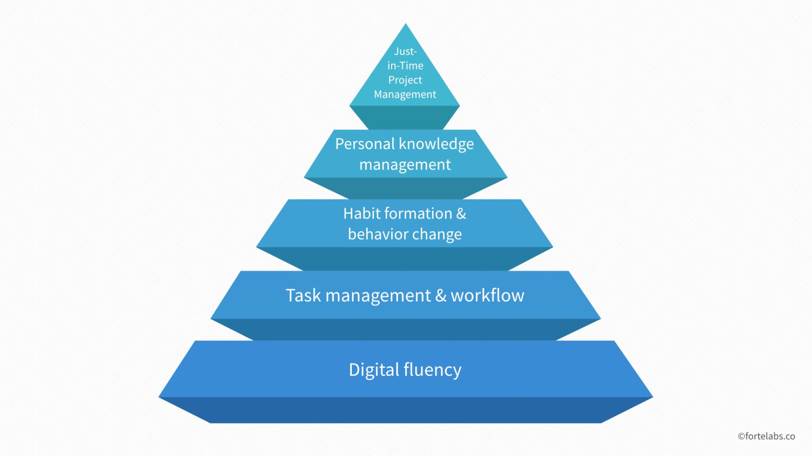
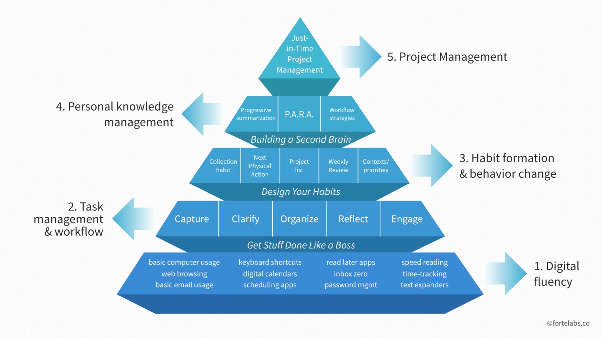
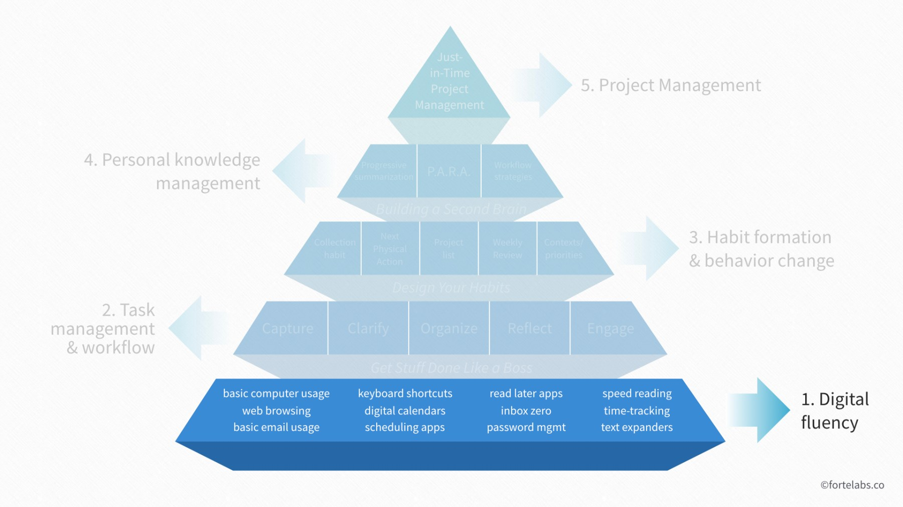
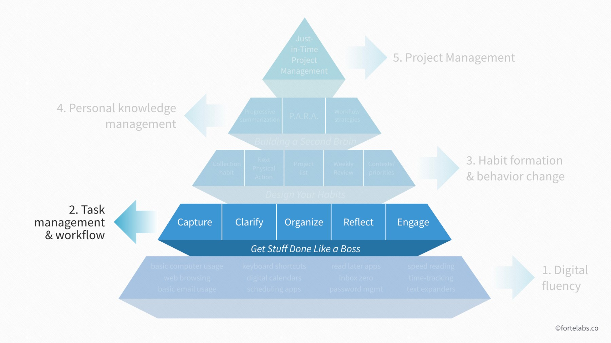
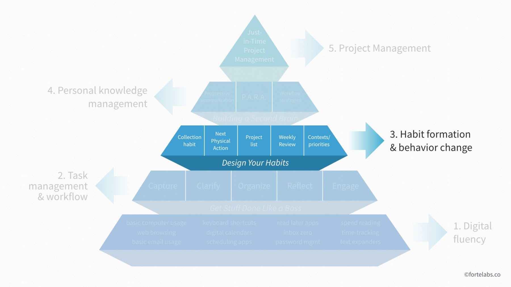
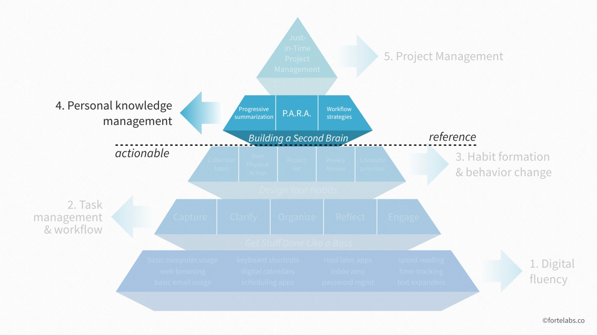
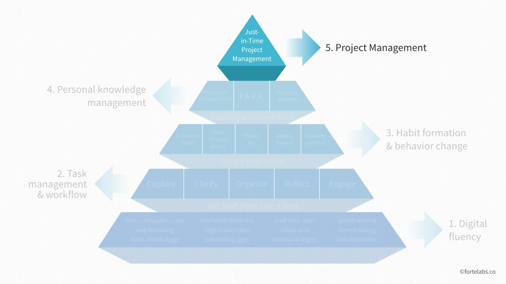

## 前言

最近我一直在思考如何思考如何提高自己的效率. 因此, 渐渐意识到, 学习一些 关乎于生产力的理论是不错的. 

这篇文章是 [Forte lab][https://fortelabs.co/blog/the-digital-productivity-pyramid/] "提高生产力, 工作效率" 的课程的引入文章.

TIAGO FORTE 提出一个 金字塔形状的 生产力模型. 看起来很有启发性, 可能是不错的参考. 就有了这篇笔记.

## 引入

在数字化的时代, 我们需要很多基础的技能 (fundamental skills): 例如, 网络检索信息, 管理邮电子件, 电子日历, 待办清单 等等.
无论任何职业, 和知识领域 的工作者 都能 从 增强这些技能中受益.

Forte labs 在过去的一段时间里, 致力于 培训 利用*数字化工具(digital tools)* 的帮助 来 提高生产力.

我们注意到了一个 **"工具陷阱"** :

- 为了一项有挑战的工作, 人们往往 (为了尝鲜? 因为他人建议?) **求助于一个新的工具** 
- 这个新的工具 在短期内 仿佛帮助了我们
- 但是, 长期以来, 这个工具 **反而成为了一种累赘: 使工作流臃肿** (new layer of complexity)
  - 我们可能学了很多工具
  - 很多工具有功能上的交集, 纠结于选哪个更合适
  - 工具之间 的连通性 也不高, 如何协作

为此, 我们创造了 **数字时代-生产力金字塔** 这个模型. 它提供了一个思想框架, 展示了 学习路程的不同阶段, 因此, 可以指导 处在某个阶段的知识工作者 接下来应该关注些什么.

上面金字塔中每一层嵌入的是各种 提高生产力的技能. 其中, 上层技能是建立在下层技能基础之上的. 每一个技能(注意, 每一层可能有多个细化得技能), 都有相应的数字化工具辅助. 我们的课程正关注这些工具.

我们希望, 这个思想框架 可以指导 任何人 (那些寻求 让目前可用的各种数字化工具 协作起来工作的人) 以新的方式来工作.

## 核心原则

**非线性原则** 

: 我们的学习方式并非 掌握一个技能, 再关注下一个技能. 提高数字化生产力的学习过程, 更像是一个螺旋形上升的过程. 
: 提高生产力不是学越来越多的工具和技能, 而是 越来越深入地学习 有限的几个 核心技能.

**技能 + 技术**

: 金字塔的每一层 都将 人类的技能 和 辅助加强or延伸 这些"技能"的**"数字化科技产品"** 配合起来. 这些数字化科技产品包括: 硬件, 软件, 在线平台.

**下层支持上层**

: 金字塔的每一层 都从 下一层发展出来, 或对应着 下层核心原则的 延伸 和 抽象.
: 每一层涉及 **初始化阶段** / **上手阶段**, 接着 会有一个更长的**优化** / **个性化**阶段

**信息流**

: 我们又把 每一层又被划分成几个模块(见下图), 这些模块以信息流动的大致方向, 从左到右排列. 这个顺序并不对应时间上的先后. 也就是说, 在实践中, 这些技能 在时间上 没有什么固定的调用顺序.

 <!-- {width=400px} -->

我们接下来一层一层地介绍这个金字塔模型

## 第一层: 流畅操作数字化工具

 <!-- {width=400px} -->

第一层包括:

- 电脑的基础操作
- 浏览网页
- 基本的邮件操作
- 键盘快捷键
- 电子日历
- 日程安排应用 (Scheduling apps)
- 稍后阅读应用
- Inbox Zero 技能
- 密码管理
- 快速阅读技能
- 时间跟踪技能
- 文字片段自动补全

深入学习这些技能没有终点. 即使那些最高阶的用户也不断地见识, 学习 新的 快捷键, 功能, 更优化的设置.

我们把这些技能归入金字塔的底层, 因为其他的层级依附于这些技能才能实现, 例如

- 着眼于可执行的任务 (Level 2) 会不断地被打扰, 以至于不能够连贯地进行.
- 创建每日工作 (Level 3), 如果没有可靠趁手的日历软件.
- 你会在文件管理(Level 4)上遇到很多麻烦, 如果email 的inbox 失控

低效率的高阶层技能 也往往可以归结为(追溯大) 薄弱的底层基础核心技能上.
低阶层的小的技能断层, 也会在 使用高阶层技能的时候 放大, 造成明显令人失望的影响.

## 第二层: 任务管理 和 工作流

 <!-- {width=400px} -->

第二层包括: (本节稍后有再次提及)

- **捕捉 (Capture)**  : 收集那些 你注意到的潜在 任务
- **明确 (Clarify)**  : 弄明白 任务的目的
- **组织 (Organize)** : 把任务归类
- **反思 (Reflect)**  : 回顾信息
- **参与 (Engage)**   : 开始着手, 行动

**任务管理** 

: 基本上是一种 "进阶的 待办清单 (To-Do Lists)". 流行的 数字任务管理工具 包括: 
Omnifocus, **Things**, Wunderlist, Todoist, 2Do, and Toodledo.

**工作流** 

: 就是 一连串步骤 : 一步一步地实现数据管理. 工作流 以**任务管理**辅助, 实现从
*识别潜在行动* , 到
*完成任务*
的过程.

尽管有很多创建 **工作流** 的方式, 其中David Allen 的 Getting Things Done (GTD) 无出其右. 
GTD的五个阶段 十分 基本, 对 **工作流**

> "实现从 *识别潜在行动* , 到 *完成任务* 的过程."

却十分重要. 我们正是用这五个阶段明明了 金字塔第二层的五个模块:

- 不完整地 **记录**（即**写下**）你的任务，绝对会成为你想接手的任何雄心勃勃的项目的瓶颈，因为决定和承诺都会被迷失。
- 试图完成那些还没有被适当 **明确** 的任务（即, 基于 *可操作 原则* 和 *结果为导向原则*, 制定的任务）是很困难和令人沮丧的，因为你不清楚为什么要做这些任务
- 即便 **记录** (罗列) 下了最全面的潜在任务，如果不加以 **组织**，使其能够迅速确定并采取行动，那么再全面的任务也是无用的。
- 战略决策 依赖于 专门的, 严肃的 **反思** 时间，这样 才能使收集到的所有信息有意义。
- 当然，所有这些工作如果没有实际 **参与** 和 **行动**，都相当于过度的记录保存。

相关阅读:

- [年审(Annual Review) 是 一种 "重新归档"](https://praxis.fortelabs.co/the-annual-review-is-a-rearchitecture-958eef1d293a/)
- [月审(Monthly Review) 是 一次 "系统的检查"](https://praxis.fortelabs.co/the-monthly-review-is-a-systems-check-6eb57cb368fe/)
- [周审(Weekly Review) 是 一个 "运营系统"](https://praxis.fortelabs.co/the-weekly-review-is-an-operating-system-8e8e04f885ab/) (Wang: 不懂什么意思)
- [从 "一键式收集" 到 "收件箱清零"](https://praxis.fortelabs.co/one-touch-to-inbox-zero-a74cfa02e5bf/)

## 第三层: 形成习惯 改变行为

 <!-- {width=400px} -->

经过最初的起步阶段后，必须将第二层的 五项原则 中的每一项都置于 自动驾驶 (Autopilot自动驱动) 状态，才能充分发挥其作用。关键是要对每一项都采取一个关键的、自动的习惯:

- 捕捉 $=>$ 收集习惯
- 明确 $=>$ 下一个实际操作
- 整理 $=>$ 项目列表
- 反思 $=>$ 每周回顾
- 参与 $=>$ 背景/优先事项 (Wang:  不懂)

这些习惯让"任务管理的原则"(第二层的那些)退居幕后(即, 内化为下意识, 潜移默化地进行)，随着时间的推移，所占的注意力越来越少。了解了这些基本原则，我们就能 原创地、创造性地 为各种各样的工作需求和偏好 恰当地应用这些基本原则。

第三层 除了包括培养的习惯, 也包括 摒除 或 调整 旧有的习惯. 这需要我们审视 每个人是由哪些 **认知**, **激励机制**, **行为模式** 驱动着我们的行为. (Wang, 不懂)

相关阅读:

- [The Topology of Attention](https://fortelabs.co/the-topology-of-attention-34f65b176686/)
- [The Inner Game of Work: Focus, Desire, and Working Free](https://fortelabs.co/the-inner-game-of-work-focus-desire-and-working-free-d6312216c148/)
- [The World Beyond Your Head: How Distraction Shapes Who We Are](https://fortelabs.co/the-world-beyond-your-head-how-distraction-shapes-who-we-are-3e8ad120434a/)
- [A Theory of Unlearning: Ecstasis, Anamnesis, Kenosis](https://fortelabs.co/a-theory-of-depatterning-ecstasis-anamnesis-kenosis-bf1a6704723e/)
- [Experimental Habit Formation](https://fortelabs.co/experimental-habit-formation-869e18447fce/)
- [Meta-Skills, Macro-Laws, and the Power of Constraints](https://fortelabs.co/meta-skills-macro-laws-and-the-power-of-constraints-4f0e2d2d6d60/)

## 第四层: 个人信息管理 (PKM)

 <!-- {width=400px} -->

这一层包括:

- 渐进式总结
- P.A.R.A.
- 安排工作流的策略

在第二层级, 我们尝试 引导**信息流**(Flow of information) 使之引发 行动. 
而第四层是关乎**知识流**(Flow of knowledge)。

个人知识管理(PKM)是指个人在完成工作的过程中，对所积累的知识进行**捕捉**、**整理**和**运用**的一套技能和工具。
它借鉴了**数字归档**、**流程管理**、**项目管理**等多个领域，很多软件程序会参与其中, 例如: 电子阅读、数字笔记、文字处理、云存储(e.g pCloud)等。

个人知识管理是 "打造第二大脑 "这门课程的主题。
"打造第二大脑" 这门课旨在 利用数字记事软件，帮助人们释放自己的创造潜能。

相关阅读:

- [Progressive Summarization](https://fortelabs.co/series/ps/)
- [P.A.R.A. Method](https://fortelabs.co/series/para/)
- [Masters of Creative Note-Taking: Luhmann and Da Vinci](https://fortelabs.co/masters-of-creative-note-taking-luhmann-and-da-vinci-49a887c5e3f/)
- [From Multitasking to Multiplexing: 5 Steps to Building a Personal Productivity Network](https://fortelabs.co/5-steps-to-build-a-second-brain-7eddbae5af95/)
- [Getting Things Done + Personal Knowledge Management](https://fortelabs.co/gtd-x-pkm-8ff720ef6939/)
- [How to Use Evernote for Your Creative Workflow](https://fortelabs.co/how-to-use-evernote-for-your-creative-workflow-f048f0aa3ed1/)
- [Tagging is Broken](https://fortelabs.co/tagging-is-broken-11e46eb24979/)

Case studies:

- [Second Brain Case Study: Teaching Progressive Summarization in an Undergraduate Classroom](https://fortelabs.co/second-brain-case-study-teaching-progressive-summarization-in-an-undergraduate-classroom-1e6dc813a152/)
- [Building a Second Brain in Emacs and Org-Mode](https://fortelabs.co/building-a-second-brain-in-emacs-and-org-mode-faa20ae06fc/)

## 第五层: 项目管理

 <!-- {width=400px} -->

作为工作中的专业人员，我们没有时间像在学校里一样，在前期消耗大量的知识，然后为了考试而回味。职业教育必须与日常工作同时进行。我们必须在飞机起飞的过程中打造飞机（并学会驾驶它）。

要想让PKM可持续发展，它需要直接让实际项目的执行成为可能。这就是为什么Just-in-time项目管理是金字塔的顶点。我们所收集和管理的知识需要有一个**即时的回报**才能证实他们有用，而不是只在**很远的将来**. (Wang: 在科研上, 上述的"即时性"有待斟酌)

虽然你不需要先建好1-4层，然后才开始做真正的项目，但你能成功执行的项目规模和野心都是受制于你的金字塔的结构完整性。你想建造的建筑越高，你的地基必须越深，越坚固。

## References
